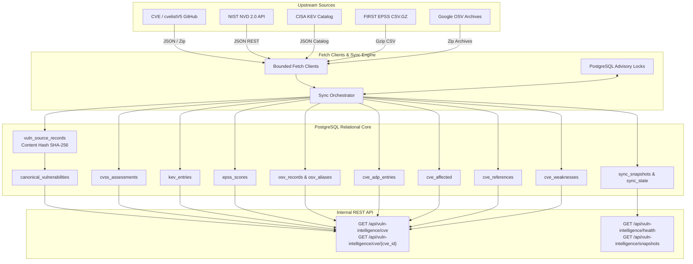

# Tempris V2 Vulnerability Intelligence Core — Canonical Architecture, Operational & Verification Guide

> **Document Status**: Authoritative Canonical Specification  
> **Version**: V1.0.0 (Sprint 04 Vertical Slice Frozen)  
> **Release Target**: Tempris V2 Vulnerability Intelligence Spine  
> **Last Verified**: 2026-09-01  
> **Authoritative Precedence**: The canonical specification, governing contracts (Governing Contracts 1–10), and the automated test suite define the intended architecture and behavioral contract of the Vulnerability Intelligence Core. Any discrepancy between implementation code and these governing contracts constitutes a defect in code, not an authoritative precedence override.

---

## Table of Contents

1. [Executive Mental Model & Architectural North Star](#1-executive-mental-model--architectural-north-star)
2. [Scope, Non-Goals & Invariant Boundaries](#2-scope-non-goals--invariant-boundaries)
3. [Architecture & Multi-Source Data Flow](#3-architecture--multi-source-data-flow)
4. [Source-of-Truth & Code Location Map](#4-source-of-truth--code-location-map)
5. [Database Schema & Content-Addressed Revisioning](#5-database-schema--content-addressed-revisioning)
6. [The Five Official Source Adapters & Fetch Clients](#6-the-five-official-source-adapters--fetch-clients)
7. [Deterministic TES CVSS Resolution Matrix](#7-deterministic-tes-cvss-resolution-matrix)
8. [Sync Engine, Advisory Locking & Scheduling](#8-sync-engine-advisory-locking--scheduling)
9. [Internal Read-Only & Platform Admin REST API Reference](#9-internal-read-only--platform-admin-rest-api-reference)
10. [Tenant Isolation, RBAC & Security Boundaries](#10-tenant-isolation-rbac--security-boundaries)
11. [Configuration & Environment Reference](#11-configuration--environment-reference)
12. [Empirical Storage, Latency & Benchmark Metrics](#12-empirical-storage-latency--benchmark-metrics)
13. [Operational Runbook & Error Recovery Decision Trees](#13-operational-runbook--error-recovery-decision-trees)
14. [Automated Test Suite & Verification Matrix](#14-automated-test-suite--verification-matrix)
15. [Master Architectural Decision Matrix (Why Not X?)](#15-master-architectural-decision-matrix-why-not-x)

---

## 1. Executive Mental Model & Architectural North Star

The **Tempris V2 Vulnerability Intelligence Core** is a high-performance, deterministic vulnerability intelligence ingestion and query spine. It normalizes disparate upstream security feeds into an immutable, content-addressed relational store without flattening, modifying, or claiming proprietary authorship of upstream vendor findings.

```text
┌────────────────────────────────────────────────────────────────────────────────────────────────────────┐
│                                 CORE AXIOMS OF VULNERABILITY INTELLIGENCE                              │
├────────────────────────────────────────────────────────────────────────────────────────────────────────┤
│ 1. Immutable Upstream Provenance                                                                       │
│    - Exact upstream archive and response bytes are preserved immutably in `source_artifacts` (with    │
│      SHA-256 hash, URL, retrieval timestamp, media type, and byte size).                               │
│    - Structured source-native documents are stored in `vuln_source_records.raw_payload` (JSONB) with   │
│      content-addressed SHA-256 deduplication.                                                          │
│    - No vendor data is synthesized or claimed as Tempris-authored.                                      │
│    - Historical revisions remain accessible via atomic `is_current` pointers.                          │
│                                                                                                        │
│ 2. CISA KEV Semantics & Scope                                                                          │
│    - CISA KEV catalogue membership reflects CISA evidence of active exploitation in the wild.          │
│    - Remediation due dates established under CISA Binding Operational Directive (BOD) 22-01 apply to   │
│      Federal Civilian Executive Branch (FCEB) agencies, serving as prioritized risk guidance for       │
│      commercial and other non-federal organizations.                                                   │
│    - Full snapshot sync performs absence reconciliation strictly upon complete catalogue exhaustion    │
│      with safety mass-withdrawal thresholds (default 20%).                                             │
│                                                                                                        │
│ 3. Deterministic TES-Input CVSS Resolution                                                             │
│    - Priority order: Structural Assigning CNA Base CVSS 3.1 (`container_role = 'cna'`, Tier 1) ->     │
│      NVD Base CVSS 3.1 (`container_role = 'nvd'`, Tier 2) -> Fails closed (Unscoreable, Tier 3).       │
│    - ADP container assessments (`container_role = 'adp'`) and other versions (CVSS 4.0, 3.0, 2.0) are  │
│      preserved as raw evidence but never selected as TES inputs. No lossy translation occurs.          │
│                                                                                                        │
│ 4. Zero Tenant Exposure State Leakage                                                                  │
│    - Vulnerability intelligence is global public reference truth.                                      │
│    - Zero foreign keys to `tenant_id`, `asset_id`, `finding_id`, or `scan_id`.                         │
│                                                                                                        │
│ 5. Bounded Archive Processing & Controlled Sync                                                        │
│    - Strict resource and safety bounds (`ArchiveLimits`): 500 MB compressed, 2 GB expanded, 500,000    │
│      files, 50 MB entry, 100:1 max ratio with 1 MB minimum threshold, 300s timeout, and Zip Slip path  │
│      traversal guards. Temporary files are safely extracted with guaranteed cleanup.                   │
│    - Sync engine runs strictly outbound HTTPS/REST requests with advisory locking and savepoint        │
│      isolation. Default configuration disables background syncing (`VULN_SYNC_ENABLED=false`).          │
└────────────────────────────────────────────────────────────────────────────────────────────────────────┘
```

---

## 2. Scope, Non-Goals & Invariant Boundaries

### In-Scope
- Bounded HTTP/REST/GCS fetch clients for CVE (cvelistV5), NVD 2.0 API, CISA KEV, FIRST EPSS, and OSV archives with structured continuation cursors.
- Bounded streaming decompression and safe temporary directory extraction with strict `ArchiveLimits` resource bounds and Zip Slip protection.
- Exact immutable artifact byte storage in `source_artifacts` (BYTEA) and structured JSONB records in `vuln_source_records`.
- PostgreSQL session-level advisory locks (`pg_try_advisory_lock`) and savepoint-isolated batch transactions.
- Atomic sync snapshot tracking (`sync_snapshots`) with full cursor progress and error accounting.
- Deterministic structural TES-input resolution, CVE alias resolution, and cross-source joined querying with single-score search filtering (`min_tes_cvss`, `max_tes_cvss`).
- Fast, read-only REST API for active authenticated tenant users and platform administrators.

### Non-Goals (Strictly Deferred / Out of Scope)
- **No SCOUT / Intake Pipeline**: Scanning, asset discovery, or target probing are separate modules.
- **No Exposure Calculation**: Threat Exposure Scoring (TES), asset criticality weighting, and finding attribution belong to the Exposure / Findings subsystem.
- **No Tenant Modifiability**: Tenant analysts cannot create, edit, or override global CVE intelligence.

---

## 3. Architecture & Multi-Source Data Flow



---

## 4. Source-of-Truth & Code Location Map

| Component | File Path | Responsibility |
|---|---|---|
| **Data Models** | `backend/app/vuln_intelligence/models.py` | Data classes, Pydantic schemas, and validation logic |
| **Database Access** | `backend/app/vuln_intelligence/repository.py` | SQL queries, upserts, composed queries, and TES resolver |
| **Fetch Clients** | `backend/app/vuln_intelligence/fetch_clients.py` | Bounded HTTP/REST clients for 5 upstream sources |
| **Sync Adapters** | `backend/app/vuln_intelligence/sync_adapters.py` | Adapter glue connecting fetch clients to record processors |
| **Sync Engine** | `backend/app/vuln_intelligence/sync_engine.py` | Snapshot orchestration, advisory locks, error tracking |
| **Background Scheduler** | `backend/app/vuln_intelligence/scheduler.py` | Async background sync loop wired into FastAPI lifespan |
| **REST Router** | `backend/app/vuln_intelligence/router.py` | Read-only API and Platform Admin health endpoints |
| **Migration 005** | `backend/migrations/005_vulnerability_intelligence.sql` | Canonical 14-table schema and indexes |
| **Offline Test Suite** | `backend/tests/test_vuln_*.py` | Complete unit and integration test coverage (167 tests) |
| **Evidence Script** | `backend/scripts/collect_sprint04_evidence.py` | Live synchronization and benchmark automation |

---

## 5. Database Schema & Content-Addressed Revisioning

All source records are deduplicated using SHA-256 hashes of the canonical JSON payload:

$$\text{content\_hash} = \text{SHA256}(\text{json.dumps}(record, \text{sort\_keys}=\text{True}))$$

The Vulnerability Intelligence schema enforces dual-layer storage:
1. **Immutable Upstream Artifacts (`source_artifacts`)**: Preserves exact raw upstream response and archive bytes (BYTEA) along with SHA-256 hash, origin URL, retrieval timestamp, media type, and byte size.
2. **Parsed Structured Payloads (`vuln_source_records`)**: Preserves structured source-native JSONB documents for rapid relational indexing and querying.

When a record is updated by an upstream provider:
1. A new row is inserted into `vuln_source_records` with `is_current = TRUE`.
2. Existing revisions for the same `(source, source_id)` are set to `is_current = FALSE` atomically.
3. If the content hash matches an existing current record, the write is treated as `records_unchanged` with zero redundant sub-table churn.

```sql
-- Core Table Structure
CREATE TABLE canonical_vulnerabilities (
    cve_id VARCHAR(32) PRIMARY KEY,
    state VARCHAR(32) NOT NULL,
    date_published TIMESTAMPTZ,
    date_updated TIMESTAMPTZ,
    date_reserved TIMESTAMPTZ,
    date_rejected TIMESTAMPTZ,
    assigner_org_id TEXT,
    assigner_short_name TEXT,
    created_at TIMESTAMPTZ NOT NULL DEFAULT NOW(),
    updated_at TIMESTAMPTZ NOT NULL DEFAULT NOW()
);

CREATE TABLE vuln_source_records (
    id UUID PRIMARY KEY DEFAULT gen_random_uuid(),
    source VARCHAR(32) NOT NULL,
    source_id VARCHAR(128) NOT NULL,
    cve_id VARCHAR(32) REFERENCES canonical_vulnerabilities(cve_id) ON DELETE SET NULL,
    declared_cve_id TEXT,
    content_hash VARCHAR(64) NOT NULL,
    raw_payload JSONB NOT NULL,
    source_updated_at TIMESTAMPTZ,
    is_current BOOLEAN NOT NULL DEFAULT TRUE,
    snapshot_id UUID REFERENCES sync_snapshots(id) ON DELETE SET NULL,
    created_at TIMESTAMPTZ NOT NULL DEFAULT NOW()
);

CREATE TABLE source_artifacts (
    id UUID PRIMARY KEY DEFAULT gen_random_uuid(),
    source_record_id UUID NOT NULL REFERENCES vuln_source_records(id) ON DELETE CASCADE,
    sha256_hash TEXT NOT NULL,
    artifact_url TEXT,
    media_type TEXT,
    byte_size INTEGER NOT NULL,
    artifact_bytes BYTEA NOT NULL,
    retrieval_time TIMESTAMPTZ NOT NULL DEFAULT NOW(),
    importer_version TEXT,
    created_at TIMESTAMPTZ NOT NULL DEFAULT NOW()
);

CREATE TABLE cvss_assessments (
    id UUID PRIMARY KEY DEFAULT gen_random_uuid(),
    cve_id VARCHAR(32) NOT NULL REFERENCES canonical_vulnerabilities(cve_id) ON DELETE CASCADE,
    source VARCHAR(32) NOT NULL,
    assessor TEXT NOT NULL,
    assessment_type VARCHAR(32),
    container_role VARCHAR(32),
    provider_org_id TEXT,
    cvss_version VARCHAR(16) NOT NULL,
    vector_string TEXT NOT NULL,
    base_score NUMERIC(4, 1) NOT NULL,
    base_severity VARCHAR(32),
    exploitability_score NUMERIC(4, 1),
    impact_score NUMERIC(4, 1),
    scenario VARCHAR(64) NOT NULL DEFAULT 'GENERAL',
    raw_data JSONB,
    source_record_id UUID REFERENCES vuln_source_records(id) ON DELETE SET NULL,
    is_current BOOLEAN NOT NULL DEFAULT TRUE,
    created_at TIMESTAMPTZ NOT NULL DEFAULT NOW()
);
```

---

## 6. The Five Official Source Adapters & Fetch Clients

### 1. CVE / cvelistV5
- **Upstream**: Official CVE Project repository (`cvelistV5`).
- **Features**: Ingests CNA published metadata, descriptions, references, weaknesses, CVSS scores (with `container_role = 'cna'`), and embedded CISA ADP/SSVC container assessments (with `container_role = 'adp'`).
- **Incremental**: Git commit / dateUpdated timestamp cursor with bounded batch continuation.

### 2. NIST NVD 2.0 API
- **Upstream**: `https://services.nvd.nist.gov/rest/json/cves/2.0`
- **Features**: Official NIST REST API with `resultsPerPage`, `startIndex`, `lastModStartDate` filtering, CVSS metrics recorded with `container_role = 'nvd'`, and automatic backoff on HTTP 429/403 rate limits.
- **Auth**: Optional `NVD_API_KEY` header for elevated 50 req/30s throughput (5 req/30s without key).

### 3. CISA KEV Catalog
- **Upstream**: `https://www.cisa.gov/sites/default/files/feeds/known_exploited_vulnerabilities.json`
- **Features**: Real-time tracking of actively exploited vulnerabilities in the wild, mandatory remediation due dates under Binding Operational Directive (BOD) 22-01 (binding on FCEB agencies and serving as prioritization guidance for other organizations), and known ransomware use flags.
- **Absence Reconciliation**: Full snapshot catalog absence reconciliation executed strictly upon catalog exhaustion with 20% mass-withdrawal safety guard.

### 4. FIRST EPSS
- **Upstream**: `https://epss.cyentia.com/epss_scores-current.csv.gz`
- **Features**: Daily probability scores ($0.0 \le p \le 1.0$) and percentiles ($0.0 \le pct \le 1.0$) with bounded chunked streaming gzip decompression and `#model_version:...,score_date:...` header carryover.

### 5. OSV (Open Source Vulnerabilities)
- **Upstream**: `https://osv-vulnerabilities.storage.googleapis.com/{ecosystem}/all.zip`
- **Features**: Ecosystem package vulnerability mapping (PyPI, npm, Go, crates.io, Maven) with version intervals and exact CVE cross-reference aliases. Multi-ecosystem JSON continuation cursors (`{ecosystem: timestamp}`) and bounded incremental fetching via `modified_id.csv`.

---

## 7. Deterministic TES CVSS Resolution Matrix

The Threat Exposure Score (TES) calculation engine requires a single, deterministic CVSS 3.1 Base Score. Structural container provenance is evaluated directly from source containers (`container_role`), eliminating fragile string matching:

```text
┌──────────────────────────────────────────────────────────────────────────────────────────────────┐
│                                     TES RESOLUTION MATRIX                                        │
├──────────────────────────────────────────────────────────────────────────────────────────────────┤
│ 1. Filter current CVSS 3.1 GENERAL assessments for the CVE:                                     │
│    - cvss_version = '3.1'                                                                        │
│    - COALESCE(scenario, 'GENERAL') = 'GENERAL'                                                   │
│    - is_current = TRUE                                                                           │
│                                                                                                  │
│ 2. Tier 1: Structural Assigning CNA Container (`container_role = 'cna'`):                        │
│    - Exactly 1 current CNA CVSS 3.1 GENERAL -> Resolve Tier='cna', Score, Vector, Assessor, Sev  │
│    - > 1 current CNA CVSS 3.1 GENERAL -> Fail closed ('Ambiguous: multiple CNA CVSS 3.1 GENERAL')│
│                                                                                                  │
│ 3. Tier 2: Structural NVD / NIST Container (`container_role = 'nvd'` or `source = 'nvd'`):       │
│    - Evaluated ONLY if 0 CNA CVSS 3.1 GENERAL assessments exist                                  │
│    - Exactly 1 current NVD CVSS 3.1 GENERAL -> Resolve Tier='nvd', Score, Vector, Assessor, Sev  │
│    - > 1 current NVD CVSS 3.1 GENERAL -> Fail closed ('Ambiguous: multiple NVD CVSS 3.1 GENERAL')│
│                                                                                                  │
│ 4. Tier 3: Fail Closed (Unscoreable):                                                            │
│    - Evaluated if no eligible CNA or NVD CVSS 3.1 GENERAL assessment exists                      │
│    - (e.g. only ADP containers `container_role='adp'`, only CVSS 4.0/3.0/2.0, only non-GENERAL)  │
│    - Return is_scoreable = False, resolved_score = None                                          │
│    - Set explicit unscoreable_reason ('No eligible CNA or NVD CVSS 3.1 GENERAL assessment')     │
└──────────────────────────────────────────────────────────────────────────────────────────────────┘
```

---

## 8. Sync Engine, Advisory Locking & Scheduling

- **Session Advisory Locks**: Each source has a deterministic 64-bit advisory lock key derived from `SHA-256("vuln_sync:<source>")`. Prevents concurrent execution across multiple workers or pods.
- **Fail-Safe Background Scheduler**: Runs via `asyncio.create_task` during FastAPI startup **only if `VULN_SYNC_ENABLED=true`**. Cancels gracefully on shutdown with zero connection leaks.
- **Isolation**: A transient failure in one source sync never impedes or blocks other sources.

---

## 9. Internal Read-Only & Platform Admin REST API Reference

### Public Read API (Any Active Authenticated V2 User)

#### `GET /api/vuln-intelligence/cve`
- **Parameters**: `q` (keyword search), `state`, `source`, `has_kev`, `has_epss`, `limit` (max 100), `offset`
- **Response**: Paginated list of canonical vulnerabilities with summary metadata.

#### `GET /api/vuln-intelligence/cve/{cve_id}`
- **Parameters**: `cve_id` (e.g. `CVE-2023-21554`)
- **Response**: Complete composed vulnerability dossier including:
  - Canonical lifecycle, assigner, descriptions
  - Full list of CVSS assessments across all versions (4.0, 3.1, 3.0, 2.0)
  - Deterministic `tes_resolution` outcome
  - CISA KEV exploitation metadata (if present)
  - CISA ADP / SSVC risk decisions (if present)
  - Current FIRST EPSS score and percentile (if present)
  - Linked OSV ecosystem package records and aliases
  - Affected vendor/product/version intervals
  - External references and CWE weakness mappings

### Platform Administrator Operational API (Requires Platform Admin Role)

#### `GET /api/vuln-intelligence/health`
- Returns operational health status, last sync timestamp, next sync schedule, duration, active records, and consecutive error counts for all 5 sources.

#### `GET /api/vuln-intelligence/snapshots`
- Returns audit logs of sync runs, record modification counts, and cursor states.

---

## 10. Tenant Isolation, RBAC & Security Boundaries

1. **Global Reference Truth**: Intelligence data is uniform for all tenants.
2. **Access Control**:
   - `get_auth_context` ensures the request is from an active user of an active tenant.
   - `require_platform_admin` enforces strict platform-admin access on operational sync endpoints.
3. **No Cross-Contamination**: Zero references to tenant assets, findings, or exposure calculations.

---

## 11. Configuration & Environment Reference

| Environment Variable | Type | Default | Description |
|---|---|---|---|
| `VULN_SYNC_ENABLED` | bool | `false` | Master toggle for background sync scheduler |
| `VULN_SYNC_INTERVAL_CVE` | int | `1200` | Sync cadence for CVE/cvelistV5 (seconds) |
| `VULN_SYNC_INTERVAL_NVD` | int | `1200` | Sync cadence for NVD 2.0 API (seconds) |
| `VULN_SYNC_INTERVAL_KEV` | int | `1200` | Sync cadence for CISA KEV (seconds) |
| `VULN_SYNC_INTERVAL_EPSS` | int | `86400` | Sync cadence for FIRST EPSS (seconds) |
| `VULN_SYNC_INTERVAL_OSV` | int | `1200` | Sync cadence for OSV archives (seconds) |
| `NVD_API_KEY` | string | `None` | Optional API key for NIST NVD 2.0 |

---

## 12. Empirical Storage, Latency & Benchmark Metrics

*Data collected on local `tempris_v2_test` during Sprint 04 verification sample:*

### Table Row Counts & Relation Storage Footprint
| Table Name | Row Count | Total Relation Size |
|---|---|---|
| `canonical_vulnerabilities` | 2,941 | 944 kB |
| `vuln_source_records` | 3,002 | 8,064 kB |
| `cvss_assessments` | 996 | 984 kB |
| `cve_affected` | 954 | 1,064 kB |
| `cve_references` | 3,448 | 1,352 kB |
| `cve_weaknesses` | 990 | 512 kB |
| `cve_adp_entries` | 2 | 440 kB |
| `cve_relationships` | 0 | 80 kB |
| `kev_entries` | 1,000 | 904 kB |
| `epss_scores` | 1,000 | 488 kB |
| `osv_records` | 1,000 | 6,272 kB |
| `osv_aliases` | 2,381 | 1,096 kB |
| `sync_snapshots` | 6 | 64 kB |
| `sync_state` | 5 | 64 kB |
| **Total Footprint** | **17,725** | **~21.3 MB** |

### Query Latencies (50 iterations benchmark)
- **Exact Composed CVE Lookup (`get_composed_cve_detail`)**: Mean **4.79 ms** (P95: 16.51 ms, Min: 1.82 ms)
- **Vulnerability Search Query (`search_vulnerabilities`)**: Mean **24.23 ms** (P95: 60.39 ms, Min: 8.47 ms)

### Idempotency Proof
- **Initial Ingestion**: 1,000 records processed $\to$ 1,000 created.
- **Second Ingestion (Identical Payload)**: 1,000 records processed $\to$ **0 created, 1,000 unchanged** (Zero DB churn).

---

## 13. Operational Runbook & Error Recovery Decision Trees

```text
┌───────────────────────────────────────────────┐
│               SYNC HEALTH ALERT               │
└───────────────────────┬───────────────────────┘
                        │
                        ▼
         Check `is_healthy` & `last_error`
        in `/api/vuln-intelligence/health`
                        │
        ┌───────────────┴───────────────┐
        ▼                               ▼
 [Rate Limit 429/403]           [Format / Parsing Error]
        │                               │
        ▼                               ▼
Verify NVD_API_KEY is valid.    Check sync_snapshots metadata.
Sync engine automatically       Verify upstream payload format.
retries with backoff.           Adapter skips corrupted entry.
```

---

## 14. Automated Test Suite & Verification Matrix

- **Total Test Suite**: 334 tests passing (100% pass rate).
- **Vulnerability Intelligence Tests**: 167 tests passing across:
  - `backend/tests/test_vuln_intelligence.py` (Database repository, models, and queries)
  - `backend/tests/test_vuln_adapters.py` (Parsing, normalization, and validation logic)
  - `backend/tests/test_sync_engine.py` (Snapshots, locking, cursor advancement, and error handling)
  - `backend/tests/test_vuln_fetch_clients.py` (HTTP clients, timeouts, pagination, and mock transports)
  - `backend/tests/test_vuln_api.py` (REST endpoints, RBAC, tenant boundary, and search filters)

---

## 15. Master Architectural Decision Matrix (Why Not X?)

| Decision | Chosen Approach | Alternative Considered | Rationale |
|---|---|---|---|
| **Content Revisioning** | SHA-256 content hashes with `is_current` pointer | Overwrite in place / Truncate & reload | Preserves full historical auditability, prevents race conditions, and eliminates sub-table churn on unchanged updates. |
| **TES CVSS Resolution** | Strict Priority (CNA 3.1 $\to$ NVD 3.1 $\to$ Unscoreable) | Average / Max / Score Mapping | Eliminates subjective score distortion; avoids inventing scores when authoritative CVSS 3.1 base vectors are missing. |
| **Concurrency Lock** | PostgreSQL Session Advisory Locks | Redis / Distributed Lock Manager | Zero additional external infrastructure dependencies; locks automatically clear if backend process disconnects. |
| **Tenant Isolation** | No tenant keys in intelligence schema | Multi-tenant shared table with `tenant_id` | Vulnerability intelligence is public reference data; adding tenant keys causes data duplication and tenant state leakage risks. |
