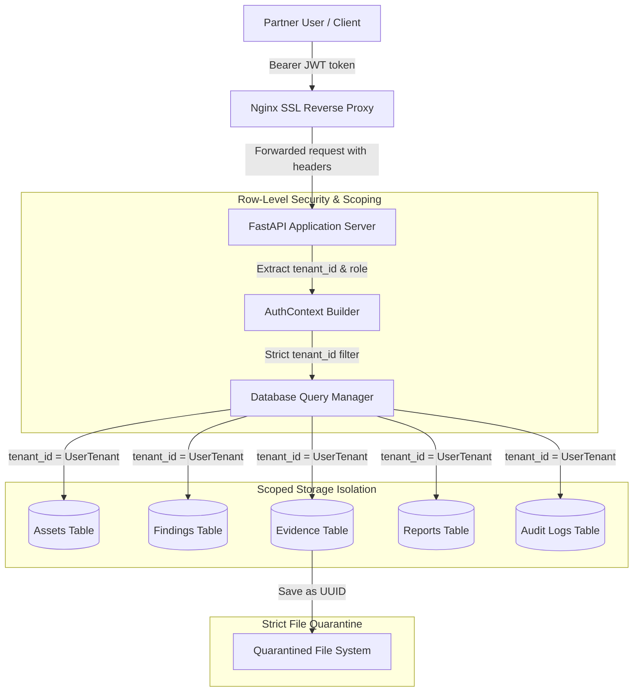

# Tenancy Separation and Data Flow Model

This document specifies the technical architecture and information flow boundaries enforcing multi-tenancy isolation within the Tempris platform.

## Architecture & Data Flow

---

## Multitenancy Isolation Matrix

The table below defines how multi-tenancy separation is enforced at the database and API layer for each sensitive resource type:

| Resource Type | DB Isolation Mechanism | API Enforcement Hook | Export & Extraction Gate |
| :--- | :--- | :--- | :--- |
| **Assets** | `tenant_id` column | Scoped in `assets.py` query filters | Scoped by tenant in CSV export |
| **Findings** | `tenant_id` column | Filtered by `tenant_id` in KEV loader | Private scoring fields redacted |
| **Evidence** | `tenant_id` column | Verified in `scoped_evidence_query` | Enforces `Content-Disposition: attachment` |
| **Reports** | `tenant_id` column | registry queries limited to caller tenant | Signatures validated via hash manifest |
| **Audit Logs** | `tenant_id` column | Filters query by tenant on fetch | Append-only SQLite/PostgreSQL locks |
| **Credentials** | Scoped users database | Locked to JWT `sub` and verified credentials | Passwords hashed via bcrypt, never returned |
| **Scans** | `tenant_id` column | Scans targeting scope IPs only | Blocked from executing broad ranges |

---

## Data Segregation Safeguards

1. **No Shared Host SSH Access:** Partner accounts cannot log in to the host machine via SSH, SSH forwarding, or SFTP. Production host SSH is locked down via SSH key authentication only for the internal CSRO infrastructure team.
2. **Quarantine Sandbox Directory:** Temporary file uploads, evidence, and report drafts are isolated into tenant-specific directory subfolders in the filesystem, preventing cross-tenant file execution or reading.
3. **Database Security:** In PostgreSQL, queries are isolated by row-level filters. In SQLite, the application layer injects `tenant_id` filters on every SELECT, UPDATE, and DELETE query.
