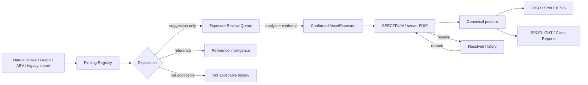
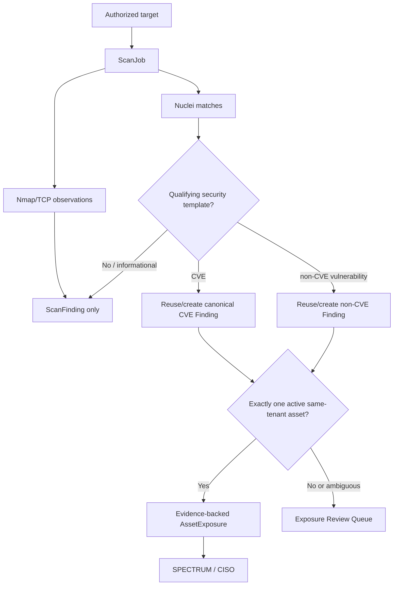
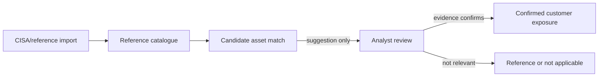
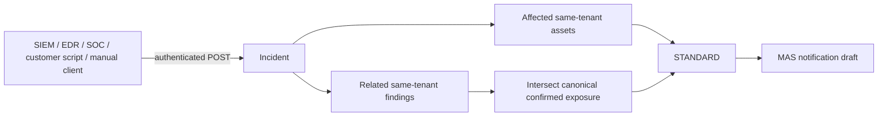
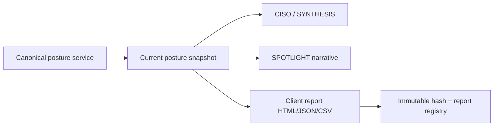
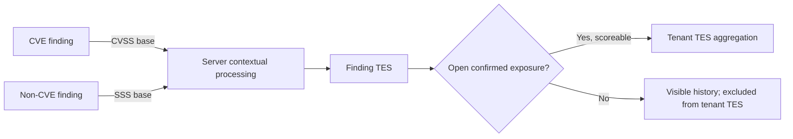

# Tempris Data Flow and Lifecycle

## Canonical finding lifecycle



```text
Manual forms / Graph / AEV / legacy import
                    |
                    v
              Finding Registry
                    |
          +---------+----------+
          |                    |
          v                    v
  Exposure Review       Reference / N/A
          |
          | Assign Assets + evidence
          v
 confirmed AssetExposure (same tenant, active asset)
          |
          v
 SPECTRUM / server EDIP --> canonical posture --> CISO / SYNTHESIS
                                             `-> SPOTLIGHT / Client Reports
```

`services.customer_posture.canonical_exposure_rows` is the authoritative inclusion rule. `Finding.asset_id`, keyword suggestions, and imported vendor/product matches do not cross the confirmation boundary.

## SCOUT scan flow



```text
Scan target -> ScanJob -> ScanFinding observation
                         |-- Nmap/TCP/technology -> observation only
                         `-- qualifying Nuclei match
                               |-- CVE -> canonical CVE Finding
                               `-- non-CVE -> canonical non-CVE Finding
                                      |
                            exact one asset? -- no/ambiguous --> review
                                      |
                                     yes
                                      v
                         evidence-backed AssetExposure
```

Idempotency uses tenant, normalized target, engine, template/CVE, port, and service to stabilize scan observations; findings use tenant plus CVE or template identity. Repeated runs update last-seen/evidence/history rather than multiplying records.

## Global intelligence flow



```text
CISA/reference import -> reference catalogue -> candidate match
                                                   |
                                                   v
                                            analyst confirmation
                                                   |
                                                   v
                                         customer exposure
```

A catalogue row never becomes a customer fact because its vendor name resembles an asset. The explicit relationship and evidence are the boundary.

## Incident flow



```text
SIEM/EDR/manual webhook -> Incident -> assets + related confirmed findings
                                      |
                                      v
                                  STANDARD
                                      |
                                      v
                            MAS notification draft
```

The compatibility API is `/api/incidents`. Idempotency is `(tenant_id, source, external_event_id)`. STANDARD refuses to manufacture an incident draft from global catalogue totals.

## Reporting flow



```text
canonical current posture -> CISO / SYNTHESIS
                          |-> SPOTLIGHT narrative history
                          `-> Client Report artifact + hash + version
```

Client Report assessment dates describe business context. They do not filter or reconstruct prior finding state. The artifact states “Current-state snapshot” and records generation time.

## TES flow



```text
CVE -> CVSS base -----\
                       server contextual processing -> Finding TES
non-CVE -> SSS base --/                              |
                                                      v
                                open confirmed population aggregation
                                                      |
                                                      v
                                                  Tenant TES
```

No browser component contains the contextual scoring internals.

## Exposure state transitions

| From | Action | To | Canonical posture effect |
|---|---|---|---|
| New/manual/connector | Create | Unmapped intake | None |
| Unmapped | Suggest asset | Suggested | None |
| Unmapped/suggested | Assign active same-tenant asset with evidence | Confirmed | Included if open and not reference/N/A |
| Any unconfirmed | Keep as Reference | Reference | Excluded |
| Any unconfirmed | Mark Not Applicable | Not applicable | Excluded |
| Confirmed open | Resolve | Resolved history | Removed from open posture |
| Resolved with confirmed link | Reopen | Confirmed open | Restored to open posture |
| Confirmed | Clear assignment | Unmapped/legacy history | Removed from canonical posture |

Each consequential transition writes audit evidence, a structured operational event where supported, and the existing finding/watch refresh event.
